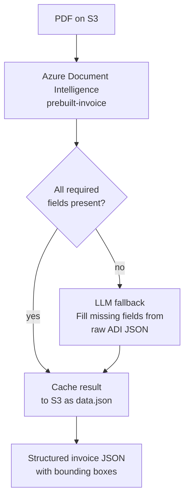

 # Invoice Extraction Studio

A full-stack invoice processing tool that uploads PDFs to S3, runs Azure Document Intelligence (ADI) to extract structured fields, and uses an LLM to fill any gaps left by the ADI model. Results are presented in a split-view UI with live PDF field highlighting and PII redaction.

---

## Extraction pipeline



---

## Field mapping

All fields extracted from the ADI `prebuilt-invoice` model. The LLM is called only when required fields are absent from the ADI response.

### Invoice metadata
| Field | ADI schema key |
|---|---|
| Invoice number | `InvoiceId` |
| Invoice date | `InvoiceDate` |
| Due date | `DueDate` |
| PO number | `PurchaseOrder` |
| Payment terms | `PaymentTerm` |
| Service start / end | `ServiceStartDate`, `ServiceEndDate` |
| Currency | Derived from `InvoiceTotal.currencyCode` |

### Vendor
| Field | ADI schema key |
|---|---|
| Name | `VendorName`, `VendorAddressRecipient` |
| Address | `VendorAddress` |
| Tax ID | `VendorTaxId` |
| Remittance recipient | `RemittanceAddressRecipient` |
| Remittance address | `RemittanceAddress` |

### Customer / billing
| Field | ADI schema key |
|---|---|
| Name | `CustomerName`, `BillingAddressRecipient` |
| Email | `CustomerEmail` |
| Customer ID | `CustomerId` |
| Tax ID | `CustomerTaxId` |
| Billing address | `BillingAddress` |
| Shipping address | `ShippingAddress` |

### Totals
| Field | ADI schema key |
|---|---|
| Subtotal | `SubTotal` |
| Discount | `TotalDiscount` |
| Tax | `TotalTax` (rate in `TaxDetails[].Rate`) |
| Invoice total | `InvoiceTotal` |
| Amount due | `AmountDue` |
| Previous unpaid balance | `PreviousUnpaidBalance` |

### Payment details (`PaymentDetails[]`)
Each entry in the array may contain:

| Field | ADI schema key |
|---|---|
| IBAN | `PaymentDetails.*.IBAN` |
| SWIFT / BIC | `PaymentDetails.*.SWIFT` |
| Bank account number | `PaymentDetails.*.BankAccountNumber` |
| BPay biller code | `PaymentDetails.*.BPayBillerCode` |
| BPay reference | `PaymentDetails.*.BPayReference` |

> Note: ADI extracts whatever bank identifiers are present on the invoice. The top-level `location` array on a `PaymentDetails` entry may be empty — bounding box data lives on the individual sub-fields (e.g. `IBAN.location`).

### Line items (`Items[]`)
| Field | ADI schema key |
|---|---|
| Description | `Items.*.Description` |
| Product code | `Items.*.ProductCode` |
| Unit | `Items.*.Unit` |
| Quantity | `Items.*.Quantity` |
| Unit price | `Items.*.UnitPrice` |
| Tax | `Items.*.Tax` |
| Tax rate | `Items.*.TaxRate` |
| Amount | `Items.*.Amount` |
| Discount | `Items.*.Discount` |

---

## Getting started

### Prerequisites
- Node.js 18+
- Python 3.11+
- AWS credentials with S3 read/write access
- Azure Document Intelligence endpoint + key
- OpenAI API key

### Environment variables

**`server/.env`**
```env
FORM_RECOGNIZER_ENDPOINT=https://<your-resource>.cognitiveservices.azure.com/
FORM_RECOGNIZER_KEY=<your-adi-key>
OPENAI_API_KEY=<your-openai-key>
AWS_REGION=us-east-1
S3_BUCKET_NAME=<your-bucket>
```

### Backend

```bash
cd server
python -m venv .venv && source .venv/bin/activate   # Windows: .venv\Scripts\activate
pip install -r requirements.txt
uvicorn main:app --reload --port 8000
```

### Frontend

```bash
cd studio
npm install
npm run dev
```

Open [http://localhost:3000](http://localhost:3000).

---

## Usage

1. Upload a PDF invoice from the home page.
2. Click **Extract** — the pipeline runs ADI, fills any missing required fields via the LLM, and caches the result to S3.
3. The split-view opens: extracted fields on the left, PDF on the right.
4. Hover any field to highlight its bounding box in the PDF.
5. Toggle **Hide PII** in the PDF toolbar to redact customer name and email.